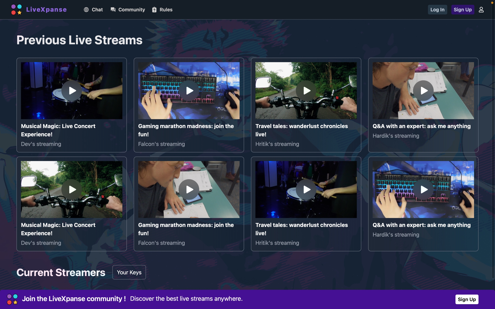
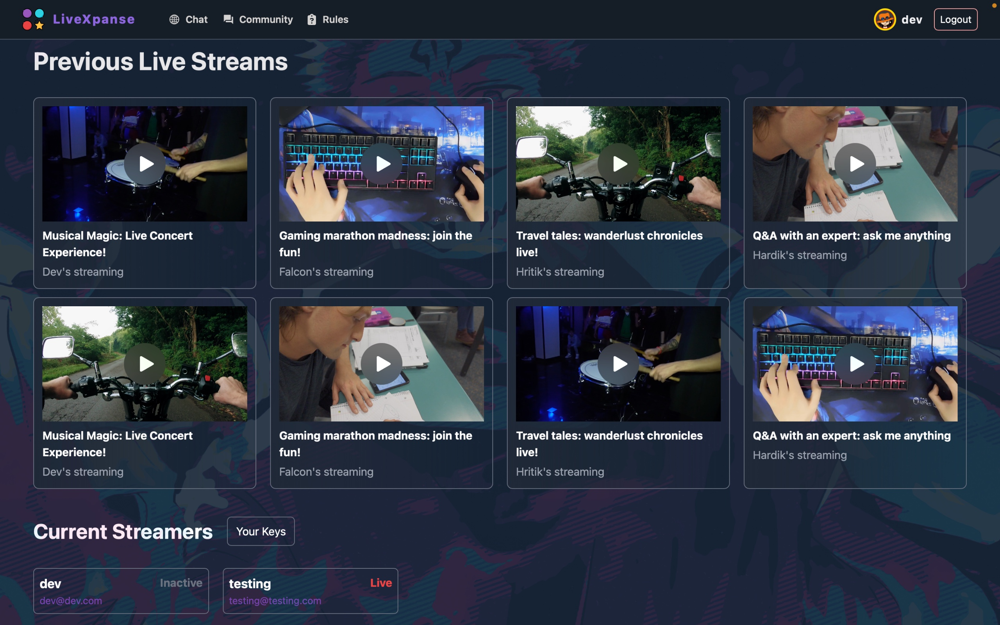
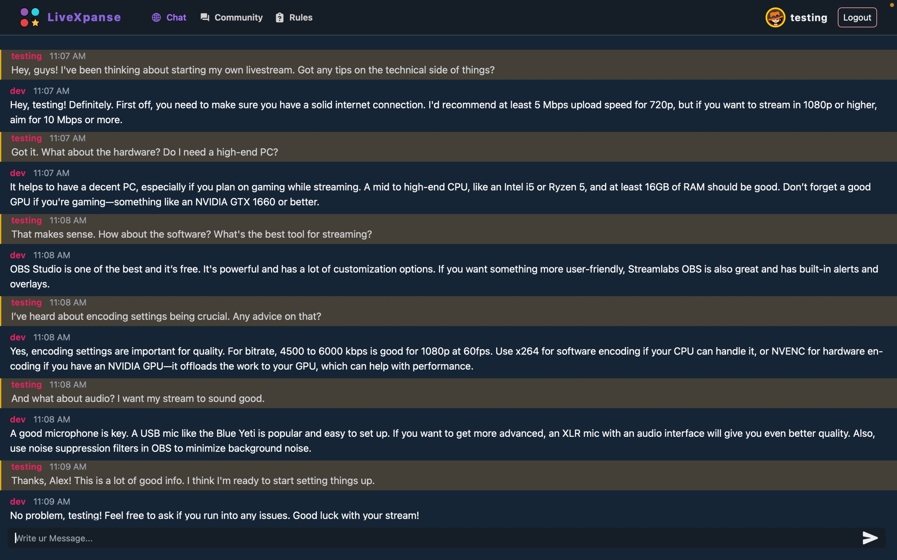
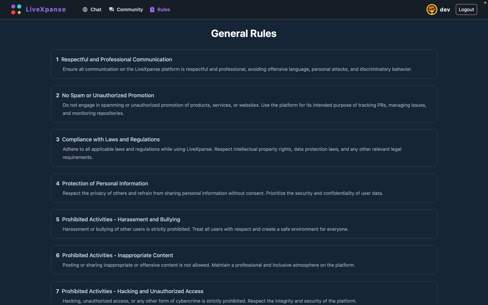
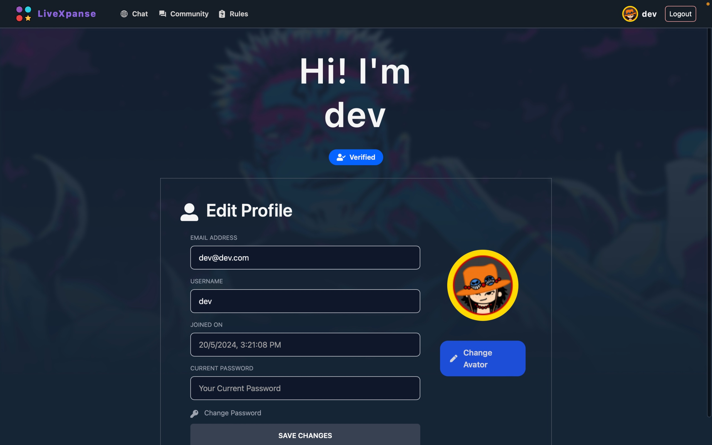
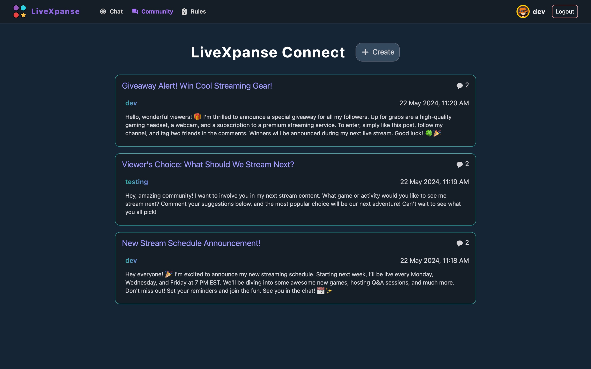
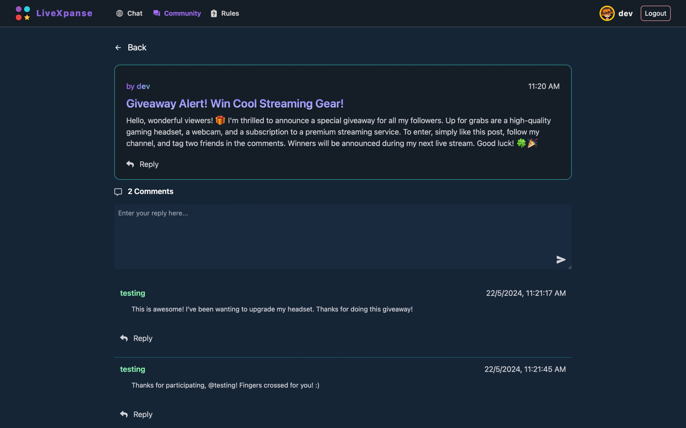
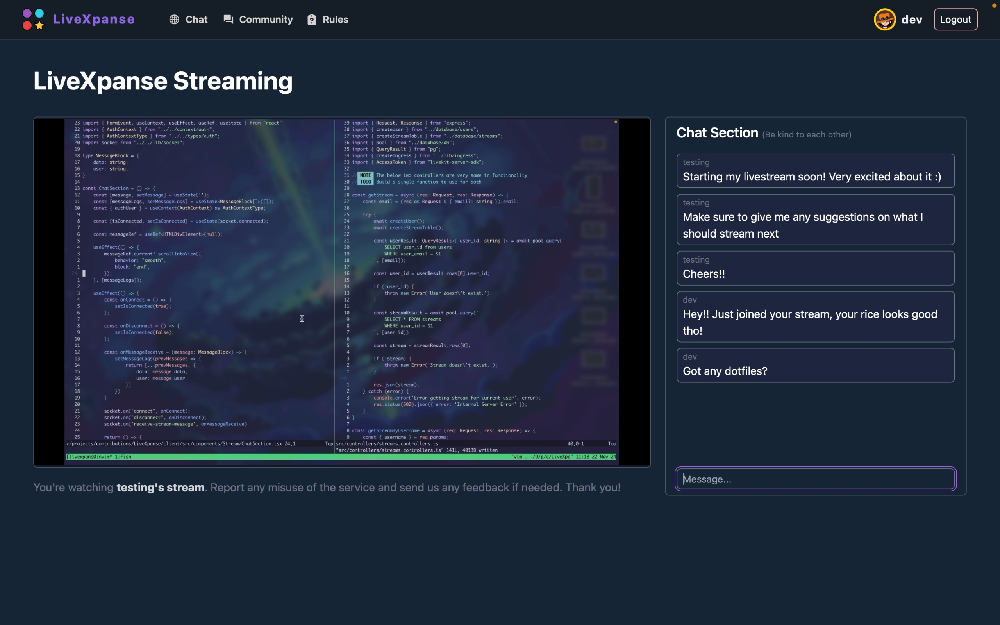

# ⚡LiveXpanse⚡
<p align="center">
  
  <br/>
</p>
<br/><br/>


## Overview
LiveXpanse aims to revolutionize digital communities by seamlessly merging collaborative streaming and engaging
forums. Through iterative development and user-centric optimization, it aspires to create a unified space where users
can share content and participate in vibrant discussions. By fostering a dynamic and cohesive community experience,
LiveXpanse sets out to redefine the landscape of digital content platforms.

## 🔥Features
- **User Authentication & Authorization:** TaskSync provides secure user authentication and authorization, ensuring that only authenticated users can access and manage tasks.
- **CRUD Operations:** Users can create, read, update, and delete tasks associated with their account.
- **Global Chat:** Using socket.io for global chat where every online users can chat with each other.
- **Community Forum:** Users can create threads , and users can replies and discuss things around the thread topic.

#### 🧬 Running locally for development

## Installation
1. Clone the TaskSync repository to your local machine:
```bash
git clone https://github.com/falcon71181/LiveXpanse
cd LiveXpanse
```

2. Navigate to the `client/` directory:
```bash
cd client/
```

3. Install client dependencies using your preferred package manager (e.g., npm, npm, yarn, bun):
```bash
npm install
```

4. Create a `.env` file in the `client/` directory and add the following variables:
```dotenv
VITE_SERVER=http://localhost:3333

# LiveKit realted values
VITE_LIVEKIT_WS_URL=<your-livekit-web-socket-url>
```

5. Navigate to the `server/` directory:
```bash
cd ../server/
```

6. Install server dependencies using your preferred package manager:
```bash
npm install
```

7. Create a `.env` file in the `server/` directory and add the following variables:
```dotenv
# DB related values and credentials
POSTGRES_USER=postgres
POSTGRES_PASSWORD=password
POSTGRES_DB=livexpanse
POSTGRES_HOST=localhost
POSTGRES_PORT=5432

# Origin and port related values
CLIENT_PORT=5173
SERVER_PORT=3333
CLIENT_ORIGIN=http://localhost:5173
SERVER_ORIGIN=http://localhost:3333

# Cors related values
ALLOWED_ORIGINS='http://localhost:5173, http://localhost:4173, http://localhost:8000'
ALLOWED_METHODS='GET, POST'

# LiveKit realted values
LIVEKIT_API_URL=<your-server-url>
LIVEKIT_API_KEY=<your-api-key>
LIVEKIT_API_SECRET=<your-api-secret>
```

## Usage
1. Start the server:
```bash
npm dev
```
### or
```bash
nodemon
```

2. Start the client:
```bash
cd ../client/
npm dev
```

3. Access the client interface at http://localhost:5173.

## 🍄Technologies Used
- postgreSQL
- TypeScript
- Tailwind CSS
- Express
- Node.js
- React.js
- JSON Web Tokens (JWT) for authentication
- Bcrypt
- LiveKit for streaming

## 🤖 References
- [LiveKit](https://livekit.io/)
- [TailwindCSS](https://tailwindcss.com/)
- [Vite](https://vitejs.dev/)
- [postgreSQL](https://www.postgresql.org/)
- [Express.js](https://expressjs.com/)
- [SocketIO](https://socket.io/)

## 💖  Contribution 🤝
Contributions to enhance the functionality or improve the codebase are welcome! Feel free to open issues or pull requests.


## ✨ Showcase









